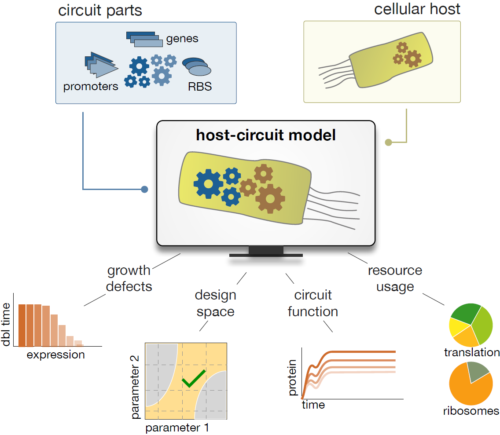

# Host-aware modelling of microbial physiology

Heterologous gene expression draws resources from host cells. These resources include vital components to sustain growth and replication, and the resulting *cellular burden* is a widely recognised bottleneck in the design of robust circuits. 

This repo implements computational models that integrate gene circuits into the physiology of *Escherichia coli* host cells and is organized as follows:
- *driver.jl* is a playground for the user;
- *helper.jl* contains all necessary helper functions to solve the ODEs, extract solutions, and run parameter sweeps;
- *host_aware_models.jl* contains the definitions for each ODE system, *i.e.* an inducible reporter gene, the NOT, AND, and NAND gates -- note that as a bonus I included a repressilator system, and in all cases the code contains the \$\kappa_{ini}\$ parameter that can be used to control the efficiency of translation initiation, as presented in Chapter 3;
- *values.jl* contains the steady state values for a host cell that does not include the heterologous constructs introduced in this work -- the steady state values are used as initial conditions for the host-aware models;
- *thesis_figures.jl* contains all necessary code and parameter values to reproduce the results presented in Chapters 2 and 3 of the thesis;
- *./figures/* contains figures for the main results of Chapters 2 and 3.