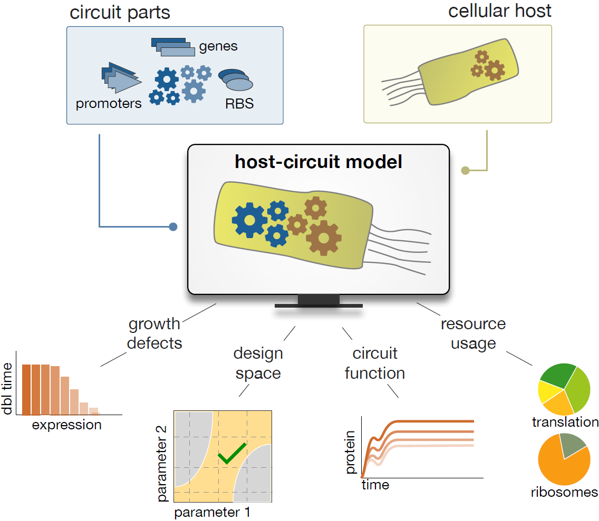

[](https://zenodo.org/doi/10.5281/zenodo.13323360)

# Host-aware modelling of microbial physiology

Heterologous gene expression draws resources from host cells. These resources include vital components to sustain growth and replication, and the resulting *cellular burden* is a widely recognised bottleneck in the design of robust circuits. 

<div style="width:20%; margin: auto;">


 
</div>

This repo implements computational models that integrate gene circuits into the physiology of *Escherichia coli* host cells and is organized as follows:

- `driver.jl` — interactive playground;
- `helper.jl` — ODE solving, postprocessing, parameter sweep utilities;
- `host_aware_models.jl` — ODE systems for host-aware circuits (reporter, NOT, AND, NAND, repressilator);
- `values.jl` — host-only steady state used as initial condition for host-aware models;
- `thesis_figures.jl` — code and parameters to reproduce thesis figures;
- `synthetic_dataset_generator.jl` — circuit-agnostic sampler + trajectory generator with optional config-driven parameter ranges;
- `run_from_config.jl` — CLI wrapper to generate datasets from a YAML config, including Python-friendly .npz export in a dedicated output directory;
- `config.yaml` — example configuration for dataset generation;
- `figures/` — saved figures for the main results of Chapters 2 and 3;
- `generated_datasets/` — (created at runtime) JLD2/NPZ files produced by dataset generation scripts.
---

## Julia environment

The code has been tested with:

- **Julia** ≥ 1.12
- Core packages:
  - `DifferentialEquations`
  - `Sundials`
  - `JLD2`
  - `YAML`
  - `NPZ`

A minimal way to set up the environment is:

```julia
using Pkg
Pkg.activate(".")
Pkg.add([
    "DifferentialEquations",
    "Sundials",
    "JLD2",
    "YAML",
    "NPZ",
    "Plots",
])
```
---

## Synthetic dataset generation

In addition to the original host-aware models, this repository now includes a config-driven synthetic dataset generator that can be used to create high-dimensional time-series datasets.

## Key files

`synthetic_dataset_generator.jl`
Core sampler + generator that:
- Samples design + environment parameters for each circuit,
- Simulates the corresponding ODE model,

Returns:
- `X :: Array{Float64,3}` of size `(N, T, D)` — all state variables over time;
- `Z :: Array{Float64,2}` of size `(N, P)` — design + environment features;
- `T_GRID :: Vector{Float64}` — the common time grid.

`run_from_config.jl`
CLI wrapper that:
- Reads a YAML config (`config.yaml`),
- Builds a sampling configuration per model,
- Calls `generate_dataset(...)`,
- Saves both a .jld2 file and a Python-friendly .npz file in a dedicated output directory.

`config.yaml`
Example configuration that specifies:
- Which model to use (`HETER`, `REPR`, `NOT`, `AND`, `NAND`),
- Number of trajectories, RNG seed, and output directory,
- Optional parameter ranges for sampling (per model, per parameter).
---

## Usage
### 1. Direct Julia REPL / script usage

You can call the generator directly from Julia using any of the ODE models:

```julia
include("synthetic_dataset_generator.jl")

# Example: AND gate
X, Z = generate_dataset(
    AND_gate_ODE_model!,
    10;
    outfile      = "and_10.jld2",
    seed         = 1,
    sampling_cfg = nothing,  # or a ModelSamplingConfig if you build one manually
)
```

This writes `and_10.jld2` in the current directory and returns `(X, Z)` in memory.

### 2. Config-driven CLI workflow

The recommended workflow is to drive everything from a YAML config.

Example `config.yaml`
```yaml
dataset_name: and_koopman_example
model: AND
N: 200
seed: 123

# Directory where all generator outputs will be written
output_dir: generated_datasets

# Write a Python-compatible NPZ alongside the JLD2 file
python_format: npz

# JLD2 filename (inside output_dir)
outfile: and_200.jld2

# Optional: sampling ranges for parameters of a given model
params:
  AND:
    ns:
      dist: linear
      min: 0.1
      max: 1.0
    kappa_ini:
      dist: log10
      min: -0.65
      max: 0.0

    wmaxrep_1:
      dist: log10
      min: 0.0
      max: 3.0
    wmaxrep_2:
      dist: log10
      min: 0.0
      max: 3.0
    wmaxrep_3:
      dist: log10
      min: 0.3
      max: 3.5

    kbrep_1:
      dist: log10
      min: -3.0
      max: -1.0
    kbrep_2:
      dist: log10
      min: -3.0
      max: -1.0
    kbrep_3:
      dist: log10
      min: -3.0
      max: -1.0

    kurep_1:
      dist: log10
      min: -3.0
      max: -1.0
    kurep_2:
      dist: log10
      min: -3.0
      max: -1.0
    kurep_3:
      dist: log10
      min: -3.0
      max: -1.0

    Kq_rep_1:
      dist: log10
      min: 1.7
      max: 4.0
    Kq_rep_2:
      dist: log10
      min: 2.0
      max: 4.2

    nq_rep_1:
      dist: linear
      min: 1.0
      max: 4.0
    nq_rep_2:
      dist: linear
      min: 1.0
      max: 4.0
```

Any parameter not listed under params.<MODEL> falls back to the default ranges used in the original thesis simulations.

### Running from the command line

From the repository root:
`julia run_from_config.jl config.yaml`

This will:
- Simulate `N` trajectories for the selected model,
- Write:
    - `generated_datasets/and_200.jld2`
    - `generated_datasets/and_200.npz`
---

## Python integration
The `.npz` files generated by `run_from_config.jl` are directly usable from Python:

```python
import numpy as np

data = np.load("generated_datasets/and_200.npz")

X = data["X"]  # shape (N, T, D)
Z = data["Z"]  # shape (N, P)
T = data["T"]  # shape (T,)
```

This makes it straightforward to plug the host-aware synthetic datasets into sequence models that expect `(batch, time, features)` tensors.

---

## Reproducing thesis figures

To reproduce the main figures from Chapters 2 and 3, use:

```julia
include("thesis_figures.jl")
# call the corresponding figure-generation routines as documented in that file
```

See `thesis_figures.jl` for details on each figure and the specific parameter settings used in the thesis.